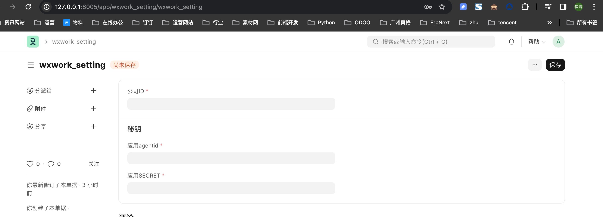
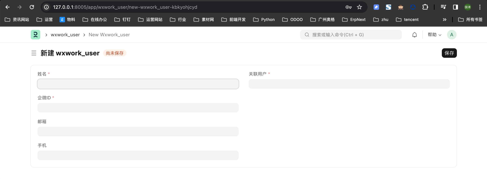
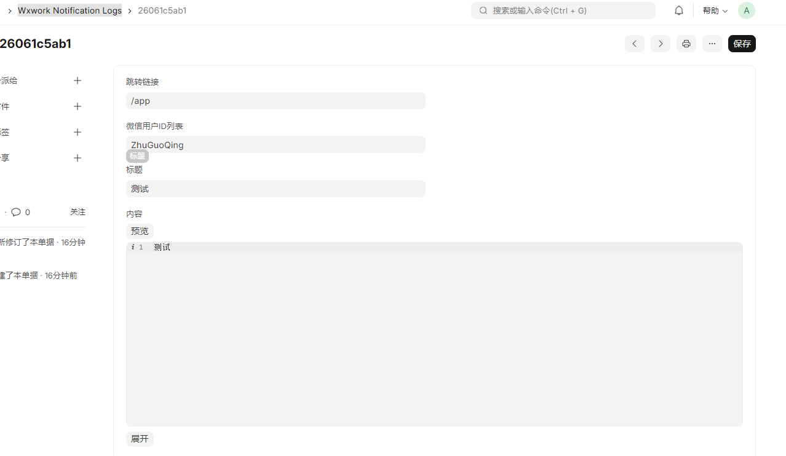

## Erpnext Wxwork

集成企业微信

1.在企业微信客户端无密码登录

2.Notification Logs 推送到企业微信

#### 安装方法

#如果获取失败，大概率是pip install wechatpy 失败，可以通过指定安装源来手动安装 pip install -i https://pypi.tuna.tsinghua.edu.cn/simple wechatpy==1.8.18
bench get-app https://gitee.com/shuigu/erpnext_wxwork.git

bench install-app erpnext_wxwork

实施步骤
1.创建企业微信应用
2.配置wxwork_setting

3.新增wxwork_user绑定erpnext user

4.设置企业微信应用的首页：
设置方法http://erp.your.com/api/method/erpnext_wxwork.oauth.redirect?url=%2Fapp%2Fhome
要替换两个信息
1.域名：把http://erp.your.com换成自己的
2.跳转路径：把url=%2Fapp%2Fhome  换成要跳转的路径

备注： 如果网站域名与部署的域名不一致，请当前网站配置文件加上这个domain配置 例子 sites/erp.bus.com/site_config.json加上"domain":"erp.bus.com"

#### 如何手动发送企业微信通知

往Wxwork Notification Logs 插入一条数据erpnext_wxwork会自动发生一条企业微信通知

